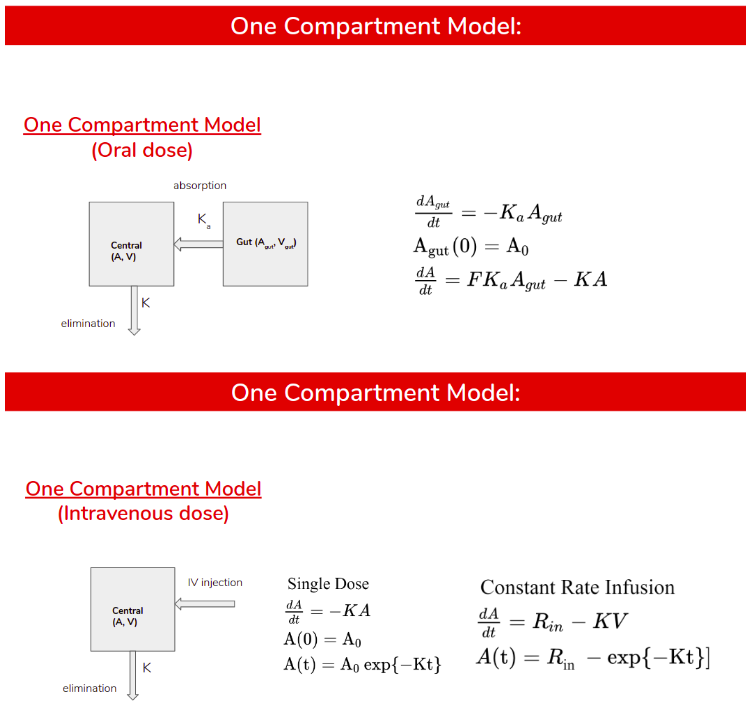
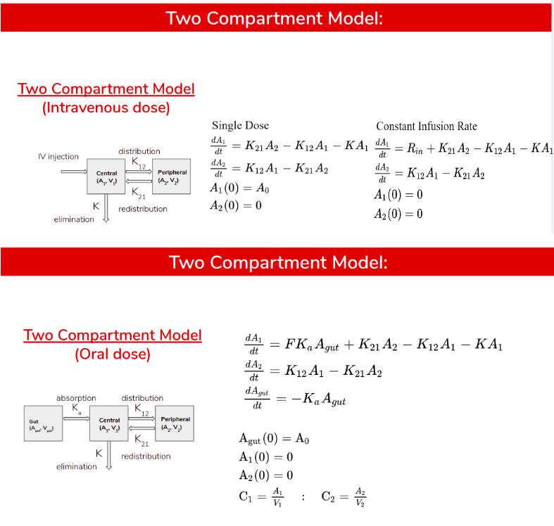
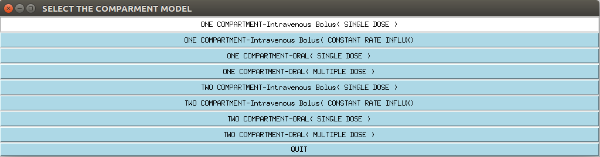

# pharmocokinetics_compartmentModel

### Description

TODO

## Model Kinetics --


- Note: For multi-dose kinetics stay tuned!
### Setup
#### clone the project --
```
git clone https://github.com/ac-optimus/pharmacokinetics_compartmentModel.git
```
####  Install tkinter --
```
sudo apt-get install python3-tk
```
#### Instal other dependencies --
```
pip install -r requirements.txt
```

### Usage


* Update the constants in constants.json <br /> 
* run ```python main.py```


#### Select the option based on desired model --

